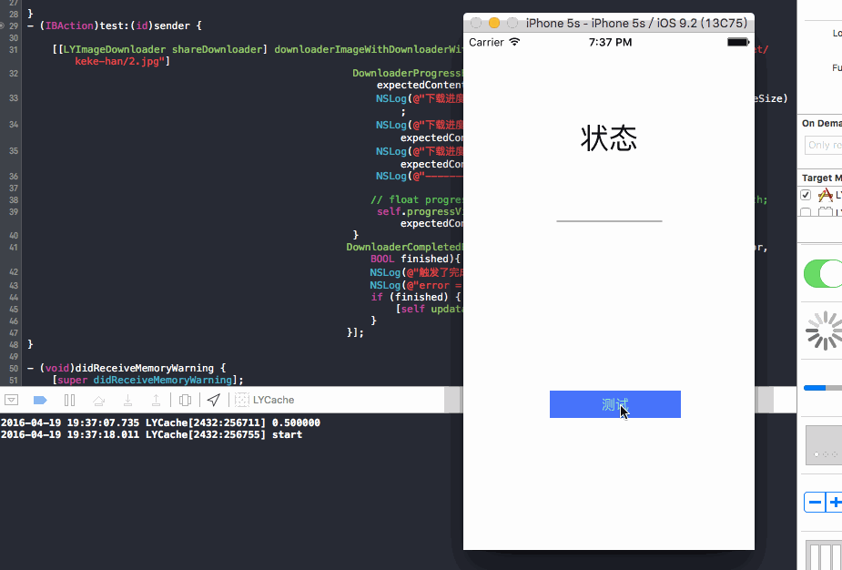
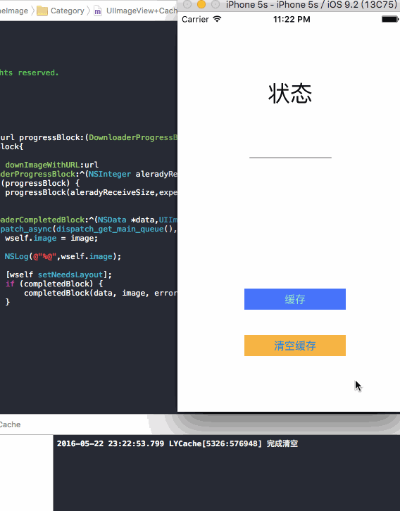

* 大家好，我叫LastDays，大三学生，目前在腾讯实习，这是我的[Blog](lastdays.cn)，我在这里分享我的学习，
* 我的[微博](http://weibo.com/p/1005055848341536/home?from=page_100505&mod=TAB&is_all=1#place)我在这里分享我的生活，欢迎交流
* 并且欢迎加入qq群554602551，这里我们一起交流分享

一直都想写一个关于图片缓存方案的，但是积累不够，一直扔在这，最近开始尝试。就先从我写下载开始分享。

## 下载


下载的话，我查阅了很多人写的，像SDWebImage，使用的是NSURLConnection，但是我这里准备使用NSURLsession，使用NSURLSessionDataDelegate的代理方法实现下载数据.

说点题外话：我为什么选择NSURLsession二部选择NSURLConnection。因为iOS９之前在做网络连接的时候,我们使用的时NSURLConnection,但是iOS9之后NSURLConnection宣布被弃用了,在2013年的WWDC大会上，苹果就已经设计出NSURLConnection的继任者NSURLSession，他使用起来比NSURLConnection更加简单，更加强大。

在这个过程当中，还会用到GCD与NSOperation来管理下载线程，为什么混合使用呢？我们使用子类化NSOperation来高复抽象我们的下载线程进行抽象化，这样使我们的下载模块更加清晰，在整个不算太复杂的下载过程中，让接口变得简单。GDC我们在下载中局部会使用到，GCD的优点我们都知道，简单，易用，节省代码，使用block让代码变得更加简洁。


基本上使用的东西上面都总结完了，开始进入下载的设计。

<!-- more -->

### 线程程管理器

使用子类化自定义NSOperation，这样一个下载就是一条线程，管理这些线程的话，就需要一个下载管理器，我们就是先来构建这个下载管理器。

这个管理器在整个下载模块中起到的就是对线程资源进行管理，起到一个工具的作用，这样的话我们需要把管理器构建成一个单例类，所以这里我们需要先使用单例模式来达到数据共享的目的。

``` bash
+(instancetype)shareDownloader{
    
    static LYImageDownloader *lyImageDownloader;
    static dispatch_once_t onceToken;
    dispatch_once(&onceToken, ^{
        lyImageDownloader = [[LYImageDownloader alloc] init];
    });
    return lyImageDownloader;
}
 
```

以上就是我们下载管理器的单例。


整个下载的时候，通过阅读开源库，查找资料，发现很多的设计者他们的下载都具备状态监听，这个状态指的就是像下载进度，完成进度，错误信息回调。这些都是下载过程中，我们需要实时知道的东西。

这些信息都准备以block回调的形式展现，具体如下：

``` bash
/**
 *  无参数block
 */
typedef void(^DownloaderCreateBlock)();

/**
 *  下载回调信息，下载进度Block
 *
 *  @param AlreadyReceiveSize 已经接收大小
 *  @param NotReceiveSize     未接收大小
 */
typedef void(^DownloaderProgressBlock)(NSInteger alreadyReceiveSize,NSInteger expectedContentLength);

/**
 *  下载回调信息，完成下载Block
 *
 *  @param data     data
 *  @param image    图片
 *  @param error    错误信息
 *  @param finished 是否完成
 */
typedef void(^DownloaderCompletedBlock)(NSData *data,UIImage *image,NSError *error,BOOL finished);

```

在整个下载中，我们还需要有一些配置选项，例如是否允许后台下载，选择队列下载方式，还是栈的下载方式.所以设置了以下的选项。

``` bash
typedef NS_OPTIONS(NSInteger,DownloaderOptions) {
    
    //默认下载操作
    DownloaderDefault = 1,
    
    //允许后台操作
    DownloaderContinueInBackground = 2
};

typedef NS_ENUM(NSInteger,DownloaderOrder){
    
    //默认下载顺序，先进先出
    DownloaderFIFO,
    
    //先进后出
    DownloaderLIFO
};
```

基本的信息构建完成，我考虑的就是需要将这些状态的回调信息存在一个NSMutableDictionary中，key值就是我们的下载地址，value就是NSMutableArray，里面包含所DownloaderProgressBlock，DownloaderCompletedBlock进度信息。

定义了一下属性：

``` bash
/**
 *  将所有的下载回调信息存储在这里，Key是URL，Value是多组回调信息
 */
@property(strong,nonatomic) NSMutableDictionary *downloaderCallBack;
```

在一个下载开始之前，需要加载，或者是删除一些状态信息，构建了以下的函数。

``` bash
/**
 *  添加回调信息
 *
 *  @param progressBlock         DownloaderProgressBlock
 *  @param completedBlock        DownloaderCompletedBlock
 *  @param url                   url
 *  @param DownloaderCreateBlock DownloaderCreateBlock
 */
-(void)addWithDownloaderProgressBlock:(DownloaderProgressBlock)progressBlock DownloaderCompletedBlock:(DownloaderCompletedBlock)completedBlock URL:(NSURL *)url DownloaderCreateBlock:(DownloaderCreateBlock)downloaderCreateBlock{
    
    /**
     *  判断url是否为空
     */
    if ([url isEqual:nil]) {
        completedBlock(nil,nil,nil,NO);
    }
    
    /**
     *  设置屏障，保证在同一时间，只有一个线程可以操作downloaderCallBack属性,保证在并行多个处理的时候，对downloaderCallBack属性的读写操作保持一致
     */
    dispatch_barrier_sync(self.concurrentQueue, ^{
        
        BOOL firstDownload = NO;
        /**
         *  添加回调信息，处理同一个url信息。
         */
        if(!self.downloaderCallBack[url]){
            self.downloaderCallBack[url] = [NSMutableArray new];
            firstDownload = YES;
        }
        
        NSMutableArray *callBacksArray = self.downloaderCallBack[url];
        NSMutableDictionary *callBacks = [[NSMutableDictionary alloc] init];
        if (progressBlock) {
            callBacks[@"progress"] = [progressBlock copy];
        }
        if (completedBlock) {
            callBacks[@"completed"] = [completedBlock copy];
        }
        [callBacksArray addObject:callBacks];
        self.downloaderCallBack[url] = callBacksArray;
                
        if (firstDownload) {
            downloaderCreateBlock();
        }
    });
}

```

首先就是判断当前的url是否为空，如果为空，直接回调空处理。不为空的话，为了防止同一URL的value被重复创建，我们需要在这里判断下原来是否存在，是否为第一次下载，是第一下下载的话，这里我们会触发adownloaderCreateBlock()的回调来进行operation的配置，当然如果不是第一次，我就仅仅需要把这个新的DownloaderProgressBlock，DownloaderCompletedBlock放进callBacksArray中即可。

这里为了保证downloaderCallBack的线程安全性，我们加了一个屏障，来保证每次只有一个线程操作downloaderCallBack属性。


这么做的一个好处就是，我每一个下载，我判断一下是不是同一URL，是的话我就做伪下载，就是感觉上下载，但是不下载，然后已经正在下载进度会同时反馈给当前其他相同的下载请求。

整个下载管理器，我们需要将下载在一个模块中被管理。就像下面这样

``` bash
/**
 *  下载管理器对于下载请求的管理
 *
 *  @param progressBlock  DownloaderProgressBlock
 *  @param completedBlock DownloaderCompletedBlock
 *  @param url            url
 */
-(void)downloaderImageWithDownloaderWithURL:(NSURL *)url DownloaderProgressBlock:(DownloaderProgressBlock)progressBlock DownloaderCompletedBlock:(DownloaderCompletedBlock)completedBlock{
    
    __weak __typeof(self)myself = self;
    __block LYDownloaderOperation *operation;
    
    
    [self addWithDownloaderProgressBlock:progressBlock DownloaderCompletedBlock:completedBlock URL:url DownloaderCreateBlock:^{
        
        NSMutableURLRequest *request = [[NSMutableURLRequest alloc] initWithURL:url cachePolicy: NSURLRequestReloadIgnoringLocalCacheData timeoutInterval:20];
        
        operation = [[LYDownloaderOperation alloc] initWithRequest:request
                                                 DownloaderOptions:1
                                           DownloaderProgressBlock:^(NSInteger alreadyReceiveSize,NSInteger expectedContentLength){
    
                                               __block NSArray *urlCallBacks;
                                               
                                               dispatch_sync(self.concurrentQueue, ^{
                                                   urlCallBacks = [myself.downloaderCallBack[url] copy];
                                               });
                                               for (NSDictionary *callbacks in urlCallBacks) {
                                                   dispatch_async(dispatch_get_main_queue(), ^{
                                                       DownloaderProgressBlock progress = callbacks[@"progress"];
                                                       if (progress) {
                                                           progress(alreadyReceiveSize,expectedContentLength);
                                                       }
                                                   });
                                               }
                                           }
                                          DownloaderCompletedBlock:^(NSData *data,UIImage *image,NSError *error,BOOL finished){
                                              completedBlock(data,image,error,finished);
                                          }
                                                         cancelled:^{
                                                             
                                                         }];
        [myself.downloadQueue addOperation:operation];
        
    }];
}
```

这部分主要就是在配置我们的operation，将配置完成后的operation添加到下载队列。

``` bash
/**
 *  下载队列
 */
@property(strong,nonatomic) NSOperationQueue *downloadQueue; 

```

``` bash
[myself.downloadQueue addOperation:operation];
```

在这里：

``` bash
DownloaderProgressBlock:^(NSInteger alreadyReceiveSize,NSInteger expectedContentLength){
    
                                               __block NSArray *urlCallBacks;
                                               
                                               dispatch_sync(self.concurrentQueue, ^{
                                                   urlCallBacks = [myself.downloaderCallBack[url] copy];
                                               });
                                               for (NSDictionary *callbacks in urlCallBacks) {
                                                   dispatch_async(dispatch_get_main_queue(), ^{
                                                       DownloaderProgressBlock progress = callbacks[@"progress"];
                                                       if (progress) {
                                                           progress(alreadyReceiveSize,expectedContentLength);
                                                       }
                                                   });
                                               }
                                           }
```

就是进度的回调通知，在这里可以知道，如果我们使用了GCD，保证通知对象加载完整后在进行通知


``` bash
dispatch_sync(self.concurrentQueue, ^{
                                    urlCallBacks = [myself.downloaderCallBack[url] copy];
                                               });
                                               
```
这里使用同步保证了我们进度被通知对象的完整性。

接下来的话就是异步回调通知了，下面的其他地方的基本结构也都做了类似的处理。主要就是保证每一条下载线程，每一条通知都安全的进行着。在完成下载的时候移除对应url的状态，这里也是为了保证downloaderCallBack的线程安全性，我们加了一个屏障，来保证每次只有一个线程操作downloaderCallBack属性。

### 子类化NSOperation

这里开始就是做下载处理了。需要做的就是重写start方法，在这里创建并且配置NSURLSession对象。

``` bash
-(void)start{
    NSLog(@"start");
    /**
     * 创建NSURLSessionConfiguration类的对象, 这个对象被用于创建NSURLSession类的对象.
     */
    NSURLSessionConfiguration *configura = [NSURLSessionConfiguration defaultSessionConfiguration];
    
    /**
     * 2. 创建NSURLSession的对象.
     * 参数一 : NSURLSessionConfiguration类的对象.(第1步创建的对象.)
     * 参数二 : session的代理人. 如果为nil, 系统将会提供一个代理人.
     * 参数三 : 一个队列, 代理方法在这个队列中执行. 如果为nil, 系统会自动创建一系列的队列.
     * 注: 只能通过这个方法给session设置代理人, 因为在NSURLSession中delegate属性是只读的.
     */
    NSURLSession *session = [NSURLSession sessionWithConfiguration:configura delegate:self delegateQueue:nil];
    
    /**
     *  创建request
     */
    NSMutableURLRequest *request = self.request;

    /**
     *  创建数据类型任务
     */
    NSURLSessionDataTask *dataTask = [session dataTaskWithRequest:request];
    
    /**
     *  开始任务
     */
    [dataTask resume];
    
    /**
     *  在session中的所有任务都完成之后, 使session失效.
     */
    [session finishTasksAndInvalidate];
    
}
```

因为我们实现了NSURLSessionDataDelegate协议，所以可以自定义一些操作。

``` bash
//最先调用，在这里做一些数据的初始化。
-(void)URLSession:(NSURLSession *)session dataTask:(NSURLSessionDataTask *)dataTask didReceiveResponse:(NSURLResponse *)response completionHandler:(void (^)(NSURLSessionResponseDisposition))completionHandler{
    NSLog(@"开始");
    self.imageData = [[NSMutableData alloc] init];
    self.expectedContentLength = response.expectedContentLength;
    
    if (self.progressBlock) {
        self.progressBlock(0,self.expectedContentLength);
    }
    
    completionHandler(NSURLSessionResponseAllow);
    
}

//下载响应
- (void)URLSession:(NSURLSession *)session dataTask:(NSURLSessionDataTask *)dataTask
    didReceiveData:(NSData *)data{
    
    [self.imageData appendData:data];
    if (self.progressBlock) {
        self.progressBlock(self.imageData.length,self.expectedContentLength);
    }
    
    
}

//下载完成后调用
-(void)URLSession:(NSURLSession *)session task:(NSURLSessionTask *)task didCompleteWithError:(NSError *)error{
    
    self.completedBlock(self.imageData,nil,error,YES);
    [self cancel];
}

```

重写了以上的一些实现。

最后强调下这里：

``` bash
NSMutableURLRequest *request = [[NSMutableURLRequest alloc] initWithURL:url cachePolicy: NSURLRequestReloadIgnoringLocalCacheData timeoutInterval:30];
```
为了避免潜在的重复缓存，NSURLCache与自己的缓存方案，则禁用图片请求的缓存操作。

基本上我们就可以进行测试了：

写了一个简单UI，用来展示下载部分




## 缓存

缓存这个地方需要考虑的东西还是很多的，那么将会针对一下问题进行描述，设计。

* 缓存在内存，或者是磁盘，或者是内存+磁盘
* 缓存是否成功
* 缓存的容器
* 存储图片方式
* 查询图片
* 清理图片（完全清理，清理部分，其中清理部分图片的清理方式为按时间，安空间的大小）

直接上代码：

``` bash
/**
 *  进行缓存
 *
 *  @param memoryCache  内存
 *  @param image        图片
 *  @param imageData    图片data
 *  @param urlKey       key值就用来唯一标记数据
 *  @param isSaveTOdisk 是否进行沙箱缓存
 */
-(void)saveImageWithMemoryCache:(NSCache *)memoryCache image:(UIImage *)image imageData:(NSData *)imageData urlKey:(NSString *)urlKey isSaveToDisk:(BOOL)isSaveToDisk{
    
    //内存缓存
    if ([memoryCache isEqual:nil]) {
        [self.memoryCache setObject:image forKey:urlKey];

    }else{
        [memoryCache setObject:image forKey:urlKey];
    }
    
    //磁盘缓存
    if (isSaveToDisk) {
        dispatch_sync(self.ioSerialQueue, ^{
            if (![_fileMange fileExistsAtPath:_diskCachePath]) {
                [_fileMange createDirectoryAtPath:_diskCachePath withIntermediateDirectories:YES attributes:nil error:nil];
            }
            NSString *pathForKey = [self defaultCachePathForKey:urlKey];
            
            NSLog(@"%@",pathForKey);
            
            [_fileMange createFileAtPath:pathForKey contents:imageData attributes:nil];
        });
    }
}

```

注释中基本上就描述了各部分的职责，首先就是内存缓存，这里的内存缓存我用NSCache进行处理，这里用NSCache就是其实就是一个集合类型，这个集合类型维护这一个key-value结构。当某一些对象销毁的代价，或者重新生成的代价高于我们内存保留。那么我们就把它内存缓存下来就是很值的。因此重用这些对象是很值得的，毕竟我们不需要二次计算了，并且当我们的内存警报的时候，他自己会丢弃掉一些没用的东西的。
就像代码中标记的，就是做了内存缓存工作。


磁盘缓存使用NSFileManager实现，存放的位置就是沙箱的Cache文件夹内，这样就可以了。并且我们可以看到，这里我们是可以根据isSaveToDisk来判断是否需要进行磁盘的缓存，因为有一些东西是不需要缓存在磁盘中的，另外，异步操作也是很关键的一个地方，同样我们在这里使用dispatch_sync来做一些处理，实现我们的异步操作。并且这里的文件名实使用是将URL变换为MD5值。保证了唯一性。


缓存的操作基本上就完成了，既然能存，就需要对应查询。

``` bash
//查询图片
-(void)selectImageWithKey:(NSString *)urlKey completedBlock:(CompletedBlock)completed{
    UIImage *image = [self.memoryCache objectForKey:urlKey];
    if ([image isEqual:nil]) {
        NSLog(@"ok");
        completed(image,nil,ImageCacheTypeMemory);
        
    }else{
        
        NSString *pathForKey = [self defaultCachePathForKey:urlKey];
        
        NSLog(@"%@",pathForKey);
        
        NSData *imageData = [NSData dataWithContentsOfFile:pathForKey];
        UIImage *diskImage = [UIImage imageWithData:imageData];
        completed(diskImage,nil,ImageCacheTypeDisk);
    }
}
```

这里的查询基本上就是两种方式，第一种如果内存中存在，那么就在内存中读取就可以了。当然也存在着内存中不存在的可能性，这样就需要从磁盘中开始读取信息数据。根据MD5值进行索引，然后block回调给上层数据信息进行处理。


最后就是删除操作，因为如果我们设置了磁盘的上限，当我们设定的磁盘空间达到上限的时候该怎么做？当我们想清空所有缓存的时候，我们该怎么做呢？下面的这两段代码就是为了做清理磁盘空间的事情的。

``` bash
/**
 *  清空全部
 *
 *  @param completion completion
 */
- (void)clearDiskOnCompletion:(NoParamsBlock)completion
{
    dispatch_async(self.ioSerialQueue, ^{
        [_fileMange removeItemAtPath:self.diskCachePath error:nil];
        [_fileMange createDirectoryAtPath:self.diskCachePath
              withIntermediateDirectories:YES
                               attributes:nil
                                    error:NULL];
        if (completion) {
            dispatch_async(dispatch_get_main_queue(), ^{
                completion();
            });
        }
    });
}
```

这段代码的作用就是为了做清空磁盘的作用，同样是使用NSFileManager来实现。


``` bash
/**
 *  按条件进行清空(主要是时间)，这里盗用了SDWebImage的设计
 *
 *  @param noParamsBlock completion
 */
-(void)clearDiskWithNoParamsBlock:(NoParamsBlock)noParamsBlock{
    
    dispatch_async(self.ioSerialQueue, ^{
        
        NSURL *diskCache = [NSURL fileURLWithPath:self.diskCachePath isDirectory:YES];
        NSArray *resourcKeys = @[NSURLIsDirectoryKey,NSURLContentModificationDateKey, NSURLTotalFileAllocatedSizeKey];
        
        
        
        // 1. 该枚举器预先获取缓存文件的有用的属性
        NSDirectoryEnumerator *fileEnumerator = [_fileMange enumeratorAtURL:diskCache
                                                 includingPropertiesForKeys:resourcKeys
                                                                    options:NSDirectoryEnumerationSkipsHiddenFiles
                                                               errorHandler:NULL];
        
        NSDate *expirationDate = [NSDate dateWithTimeIntervalSinceNow:-60 * 60 * 24 * 7];
        NSMutableDictionary *cacheFiles = [NSMutableDictionary dictionary];
        NSInteger currentCacheSize = 0;
        
        NSMutableArray *urlsToDelete = [[NSMutableArray alloc] init];
        
        for (NSURL *fileURL in fileEnumerator) {
            NSDictionary *resourceValues = [fileURL resourceValuesForKeys:resourcKeys error:NULL];
            
            
            // 3. 跳过文件夹
            if ([resourceValues[NSURLIsDirectoryKey] boolValue]) {
                continue;
            }
            
            NSDate *modificationDate = resourceValues[NSURLContentModificationDateKey];
            if ([[modificationDate laterDate:expirationDate] isEqualToDate:expirationDate]) {
                [urlsToDelete addObject:fileURL];
                
                continue;
            }
            
            
            // 5. 存储文件的引用并计算所有文件的总大小，以备后用
            NSNumber *totalAllocatedSize = resourceValues[NSURLTotalFileAllocatedSizeKey];
            currentCacheSize += [totalAllocatedSize unsignedIntegerValue];
            [cacheFiles setObject:resourceValues forKey:fileURL];
            
        }
        
        for (NSURL *fileURL in urlsToDelete) {
            [self.fileMange removeItemAtURL:fileURL error:NULL];
        }
        
        if (self.maxCacheSize > 0 && currentCacheSize > self.maxCacheSize) {
            const NSUInteger desiredCacheSize = self.maxCacheSize / 2;
            
            // Sort the remaining cache files by their last modification time (oldest first).
            NSArray *sortedFiles = [cacheFiles keysSortedByValueWithOptions:NSSortConcurrent
                                                            usingComparator:^NSComparisonResult(id obj1, id obj2) {
                                                                return [obj1[NSURLContentModificationDateKey] compare:obj2[NSURLContentModificationDateKey]];
                                                            }];
            
            // Delete files until we fall below our desired cache size.
            for (NSURL *fileURL in sortedFiles) {
                if ([_fileMange removeItemAtURL:fileURL error:nil]) {
                    NSDictionary *resourceValues = cacheFiles[fileURL];
                    NSNumber *totalAllocatedSize = resourceValues[NSURLTotalFileAllocatedSizeKey];
                    currentCacheSize -= [totalAllocatedSize unsignedIntegerValue];
                    
                    if (currentCacheSize < desiredCacheSize) {
                        break;
                    }
                }
            }
        }
        if (noParamsBlock) {
            dispatch_async(dispatch_get_main_queue(), ^{
                noParamsBlock();
            });
        }
        
    });
    
}

```

这段代码就是实现了部分的清理工作，清理的工作就是根据我们设定的一些参数来实现的，这里包含着我们设定的缓存有效期，缓存的最大空间是多少。过了我们设定的有效期，这个时候我们就需要去清理掉这部分内容。另外如果如果所有缓存文件的总大小超过这一大小，则会按照文件最后修改时间的逆序，以每次一半的递归来移除那些过早的文件，直到缓存的实际大小小于我们设置的最大使用空间

到了这里我们的缓存的方案就基本上完成了，我们做一个小小的测试，从本地读取一个文件，然后缓存到cache文件加重，然后进行加载，看一下效果。来看一下测试代码：


``` bash
- (IBAction)read:(id)sender {
    
    LDImageCache *l = [LDImageCache shareLDImageCache];

    UIImage *myImage = [UIImage imageNamed:@"author.jpg"];
    NSData *data = UIImagePNGRepresentation(myImage);
    [l saveImageWithMemoryCache:nil image:myImage imageData:data urlKey:@"lastdays.cn" isSaveToDisk:YES];
    
    
    
    [l selectImageWithKey:@"lastdays.cn"
           completedBlock:^(UIImage *image,NSError *error,ImageCacheType type){
               NSLog(@"%ld",(long)type);
               [self.image setImage:image];
           }];
    
    
//    [l clearDiskOnCompletion:^{
//        NSLog(@"完成清空");
//    }];
    
}
```

这里的读取数据，首先我们从本地读取一个图片，然后调用saveImageWithMemoryCache:将图片数据缓存在内存和磁盘中。然后根据key值调用selectImageWithKey进行查询，这里我们输出的ImageCacheType数据，查看一下都是从哪里进行的读取。我们会优先从内存中进行读取数据。


## 管理器

实际的应用场景下我们不可能去直接使用下载跟缓存来处理完成我们的图片混存的，所以需要提供一个管理器去帮助我们直接的去完成图片的下载以及缓存工作。所以在这里我们设计一个LDSCacheManage，就是将下载和管理绑定在一起。方便上层使用。

看下具体代码：


``` bash

-(void)downImageWithURL:(NSString *)urlString DownloaderProgressBlock:(DownloaderProgressBlock)progressBlock DownloaderCompletedBlock:(DownloaderCompletedBlock)completedBlock{
    NSURL *url = [NSURL URLWithString:urlString];
    if ([urlString isKindOfClass:NSString.class]) {
        url = [NSURL URLWithString:urlString];
    }
    if (![url isKindOfClass:NSURL.class]) {
        url = nil;
    }
    [[LDSImageCache shareLDImageCache] selectImageWithKey:urlString completedBlock:^(UIImage *image,NSError *error,ImageCacheType type){
        
        if (image) {
            dispatch_async(dispatch_get_main_queue(), ^{
                NSData *data = UIImagePNGRepresentation(image);
                completedBlock(data,image,error,YES);
                NSLog(@"读取缓存");
                
            });
        }else{
            NSLog(@"进入下载");
            [[LYImageDownloader shareDownloader] downloaderImageWithDownloaderWithURL:url
                                                              DownloaderProgressBlock:^(NSInteger alreadyReceiveSize,NSInteger expectedContentLength){
                                                                  dispatch_async(dispatch_get_main_queue(), ^{
                                                                      progressBlock(alreadyReceiveSize,expectedContentLength);
                                                                  });
                                                              }
                                                             DownloaderCompletedBlock:^(NSData *data,UIImage *image,NSError *error,BOOL finished){
                                                                 dispatch_async(dispatch_get_global_queue(DISPATCH_QUEUE_PRIORITY_HIGH, 0), ^{
                                                                     [[LDSImageCache shareLDImageCache] saveImageWithMemoryCache:nil image:image imageData:data urlKey:urlString isSaveToDisk:YES];
                                                                 });
                                                                 
                                                                 dispatch_async(dispatch_get_main_queue(), ^{
                                                                     completedBlock(data,image,error,YES);

                                                                 });
                                                             }];
        }
    }];

```

可以看到，我们先是对URL的正确性进行处理转化，然后我们是根据URl先从磁盘中读取缓存的，如果磁盘中存在，直接回调image就可以了，如果没有就进入下载，这里就是调用我们的downloaderImageWithDownloaderWithURL进入下载，下载完成后我们需要做缓存

```
dispatch_async(dispatch_get_global_queue(DISPATCH_QUEUE_PRIORITY_HIGH, 0), ^{
                                                                     [[LDSImageCache shareLDImageCache] saveImageWithMemoryCache:nil image:image imageData:data urlKey:urlString isSaveToDisk:YES];
                                                                 });
```

这里我们采用的是在一个全局队列中并行处理一个缓存操作。然后回调数据。

```
+(LDSCacheManage *)shareLDCacheManage{
    static LDSCacheManage *lDSCacheManage;
    static dispatch_once_t onceToken;
    
    dispatch_once(&onceToken, ^{
        lDSCacheManage = [[LDSCacheManage alloc] init];
    });
    return lDSCacheManage;
}


```

在这里我们也是提供了一个单例。


## 视图扩展

最后就是对UIImageView做视图扩展，使其拥有异步下载和缓存远程图片的能力。

``` bash
- (void)lds_setImageWithURL:(NSString *)url progressBlock:(DownloaderProgressBlock)progressBlock completed:(DownloaderCompletedBlock)completedBlock{
    __weak __typeof(self)wself = self;
    [[LDSCacheManage shareLDCacheManage] downImageWithURL:url
                                 DownloaderProgressBlock:^(NSInteger aleradyReceiveSize,NSInteger expectedContentLength){
                                     if (progressBlock) {
                                         progressBlock(aleradyReceiveSize,expectedContentLength);
                                     }
                                     
                                 }DownloaderCompletedBlock:^(NSData *data,UIImage *image,NSError *error,BOOL finished){
                                     dispatch_async(dispatch_get_main_queue(), ^{
                                         wself.image = image;
                                         [wself setNeedsLayout];
                                         if (completedBlock) {
                                             completedBlock(data, image, error, YES);
                                         }
                                     });
                                     
                                 }];
}


```

调用LDSCacheManage，进行图片的读取，至于读取缓存内容还是去下载啊，那就交给LDSCacheManage去处理好了，我们就不管了。调用[wself setNeedsLayout]去更新视图就可以了。

## 使用

``` bash
- (IBAction)read:(id)sender {
    
    [[LDSImageCache shareLDImageCache] clearDiskOnCompletion:^{
        NSLog(@"完成清空");
    }];
    
}
- (IBAction)test:(id)sender {
    
    [self.image lds_setImageWithURL:@"https://sinacloud.net/keke-han/1.jpg" progressBlock:^(NSInteger alreadyReceiveSize,NSInteger expectedContentLength){
        self.progressView.progress = alreadyReceiveSize/(double)expectedContentLength;
        
    } completed:^(NSData *data,UIImage *image,NSError *error,BOOL finished){
        dispatch_async(dispatch_get_main_queue(), ^{
            self.status.text = @"成功";
        });
    }];
}

```

看下效果：




## 总结

* 缓存主要注意清空策略
* 下载主要还是对操作的管理
* 网络请求应用的是NSURLSession

还有很多的不足和需要改进的地方。希望大家能帮我指出。